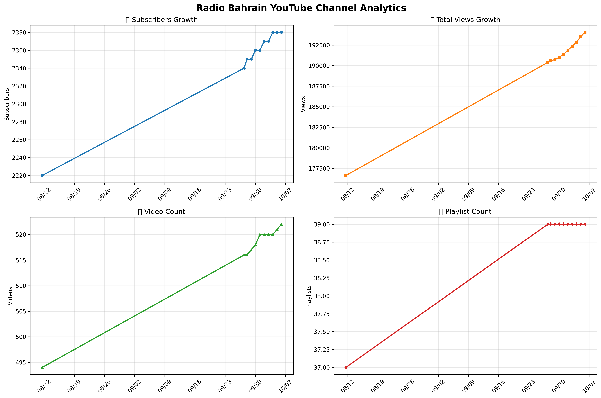

# YouTube Stats for Radio Bahrain

📊 **Latest Channel Statistics** (Updated Daily)

| Metric | Value |
|--------|-------|
| 📅 Last Updated | {{last_updated}} |
| 👥 Subscribers | {{subscribers}} |
| 👀 Total Views | {{views}} |
| 🎥 Videos | {{videos}} |
| 📝 Playlists | {{playlists}} |

## 📈 Analytics Dashboard

### Channel Growth Over Time

### Recent Growth Metrics

---

## 📊 About

This repository automatically tracks YouTube channel statistics for **Radio Bahrain** and updates daily via GitHub Actions. It provides:

- ✅ **Daily Statistics Tracking**: Automated data collection every day at midnight UTC
- 📈 **Visual Analytics**: Interactive charts showing growth trends
- 📋 **Historical Data**: Complete CSV dataset with daily snapshots
- 🔄 **Reliable Updates**: Retry logic and error handling for robust operation

## 📈 Data

- **Current Data**: [`youtube_stats.csv`](youtube_stats.csv) - Historical daily snapshots
- **Visualizations**: [`charts/`](charts/) - Generated charts and analytics

## 🔧 Technical Details

- **Automation**: GitHub Actions workflow runs daily at midnight UTC
- **API**: YouTube Data API v3
- **Language**: Python 3.9
- **Libraries**: pandas, matplotlib, requests
- **Data Format**: CSV for historical tracking
- **Charts**: PNG format, auto-generated daily

### Workflow Features

- 🔒 **Secure**: No hardcoded API keys, uses GitHub Secrets
- 🔄 **Resilient**: Automatic retry logic for API failures
- 📊 **Visual**: Generates charts automatically
- ⚡ **Fast**: Optimized for quick daily updates